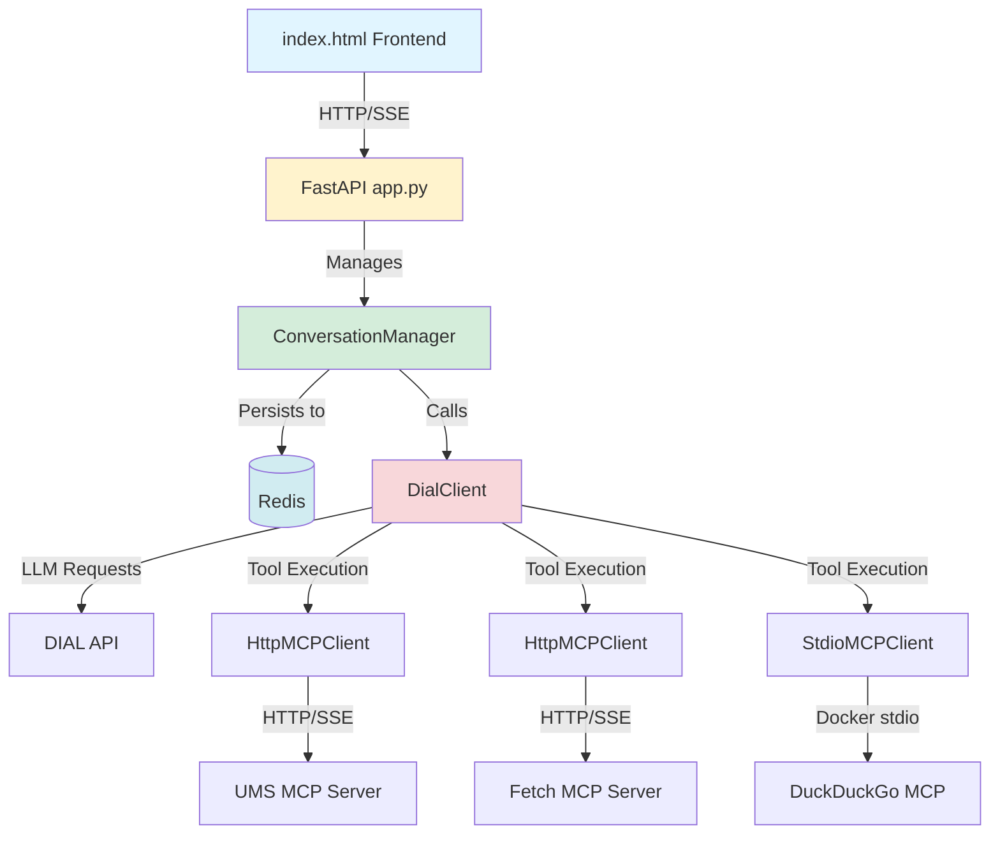

# Users Management Agent Documentation

**Production-ready AI Agent with Tool Use pattern and Model Context Protocol (MCP)**

## Overview

The Users Management Agent is a learning/workshop project that demonstrates the **Tool Use Agent** architectural pattern. It orchestrates multiple MCP (Model Context Protocol) servers to provide an AI assistant capable of managing users, searching the web, and fetching web content through natural language interactions.

### Key Features

- 🤖 **AI Tool Use Pattern**: LLM-driven tool calling with recursive execution loops
- 🔌 **Multi-MCP Integration**: Connects to HTTP and stdio-based MCP servers
- 💾 **Redis Persistence**: Conversation history and state management
- 🌊 **Streaming Support**: Real-time SSE (Server-Sent Events) response streaming
- 🎯 **DIAL API Compatible**: Works with OpenAI-compatible endpoints

## Quick Start

### Prerequisites

- Python 3.11+
- Docker & Docker Compose
- EPAM VPN access (for DIAL API)
- DIAL API key

### 5-Minute Setup

```bash
# 1. Clone and navigate to project
cd ai-dial-ums-ui-agent

# 2. Create virtual environment
python3 -m venv dial_ums
source dial_ums/bin/activate  # On Windows: dial_ums\Scripts\activate

# 3. Install dependencies
pip install -r requirements.txt

# 4. Start infrastructure services
docker-compose up -d

# 5. Set API key (required for DIAL API)
export DIAL_API_KEY="your-key-here"

# 6. Run the agent
python -m agent.app

# 7. Open index.html in browser and start chatting!
```

Access points:
- **Agent API**: `http://localhost:8011`
- **Redis Insight**: `http://localhost:6380` (database: `redis-ums:6379`)
- **UMS Service**: `http://localhost:8041`
- **UMS MCP Server**: `http://localhost:8005/mcp`

## Documentation Map

### Core Documentation

- **[Architecture](./architecture.md)** - System design, component flow, and integration points
- **[Setup Guide](./setup.md)** - Environment configuration, dependencies, and deployment
- **[API Reference](./api.md)** - Endpoints, models, and client interfaces
- **[Testing Guide](./testing.md)** - Test strategy, coverage, and debugging

### Supporting Documentation

- **[ADR Index](./adr/README.md)** - Architecture Decision Records
- **[Glossary](./glossary.md)** - Domain terms and abbreviations
- **[Roadmap](./roadmap.md)** - Milestones, features, and risk register
- **[Changelog](./changelog.md)** - Version history and notable changes

## Architecture At-a-Glance



## Project Structure

```
ai-dial-ums-ui-agent/
├── agent/                      # Core Python application
│   ├── app.py                 # FastAPI entry point, startup lifecycle
│   ├── conversation_manager.py # Redis persistence & chat orchestration
│   ├── prompts.py             # System prompt for AI agent
│   ├── clients/               # MCP and DIAL integrations
│   │   ├── dial_client.py    # LLM wrapper with tool calling loop
│   │   ├── http_mcp_client.py # HTTP-based MCP connections
│   │   └── stdio_mcp_client.py # Docker stdio MCP connections
│   └── models/
│       └── message.py         # Message/Role models for chat flow
├── docker-compose.yml         # Infrastructure services (UMS, Redis, etc.)
├── index.html                 # Frontend chat UI
├── requirements.txt           # Python dependencies
└── docs/                      # This documentation
```

## Component Responsibilities

| Component | Responsibility | External I/O |
|-----------|----------------|--------------|
| [app.py](../agent/app.py) | FastAPI endpoints, MCP client initialization | HTTP, Docker |
| [conversation_manager.py](../agent/conversation_manager.py) | Chat orchestration, Redis persistence | Redis |
| [dial_client.py](../agent/clients/dial_client.py) | LLM API calls, recursive tool execution | DIAL API, MCP clients |
| [http_mcp_client.py](../agent/clients/http_mcp_client.py) | HTTP/SSE MCP connections | Remote MCP servers |
| [stdio_mcp_client.py](../agent/clients/stdio_mcp_client.py) | Docker stdio MCP connections | Docker containers |
| [index.html](../index.html) | Web-based chat UI | FastAPI endpoints |

## Key Patterns

### Tool Use Agent Pattern

The agent implements a recursive tool calling loop:

1. User sends message → LLM generates response
2. LLM invokes tools → MCP clients execute tools
3. Tool results appended → LLM processes results (recursive)
4. Final answer returned → Conversation persisted

### Async Factory Pattern

MCP clients use async factories to avoid blocking constructors:

```python
# ✅ Correct: async factory ensures connection before use
client = await HttpMCPClient.create("http://localhost:8005/mcp")

# ❌ Incorrect: direct instantiation leaves client unconnected
client = HttpMCPClient("http://localhost:8005/mcp")  # NOT connected yet
```

### Format Conversion

MCP servers return tools in Anthropic format; DIAL expects OpenAI format:

```python
# MCP (Anthropic): {"name": "x", "description": "y", "inputSchema": {...}}
# DIAL (OpenAI): {"type": "function", "function": {"name": "x", "description": "y", "parameters": {...}}}
```

## Learning Objectives

This project teaches:

- ✅ MCP protocol integration (HTTP and stdio transports)
- ✅ LLM tool calling and recursive execution loops
- ✅ Redis persistence patterns for conversational AI
- ✅ Streaming response handling with SSE
- ✅ Multi-client orchestration and tool routing
- ✅ Async Python patterns (factories, context managers)

## Common Tasks

### Add a new MCP server

1. Create client instance in [app.py](../agent/app.py) `lifespan()`
2. Fetch tools via `get_tools()`
3. Register tools in `tools` list and `tool_name_client_map`

### Debug tool execution

1. Check logs for tool call/result messages
2. Use Redis Insight to inspect conversation state
3. Test MCP server directly via `call_tool()`

### Extend system prompt

Edit [prompts.py](../agent/prompts.py) to modify agent behavior and capabilities

## External Dependencies

| Service | Purpose | Access |
|---------|---------|--------|
| DIAL API | LLM provider (gpt-4o, claude-3-7-sonnet) | Requires EPAM VPN |
| UMS Service | Mock user management API | `http://localhost:8041` |
| UMS MCP Server | MCP interface to UMS | `http://localhost:8005/mcp` |
| Fetch MCP | Remote web fetching | `https://remote.mcpservers.org/fetch/mcp` |
| DuckDuckGo MCP | Web search via Docker | `mcp/duckduckgo:latest` |
| Redis | Conversation persistence | `localhost:6379` |

## Troubleshooting

| Issue | Solution |
|-------|----------|
| `DIAL_API_KEY not set` | Export environment variable or set in `.env` |
| Docker image not found | Run `docker pull mcp/duckduckgo:latest` |
| Redis connection refused | Ensure `docker-compose up -d` is running |
| CORS errors in browser | Verify FastAPI CORS middleware configuration |
| Tool not found | Check `tool_name_client_map` registration |

## Additional Resources

- [Model Context Protocol Specification](https://modelcontextprotocol.io/)
- [FastAPI Documentation](https://fastapi.tiangolo.com/)
- [OpenAI Function Calling Guide](https://platform.openai.com/docs/guides/function-calling)
- [Redis Python Client](https://redis-py.readthedocs.io/)

## Contributing

This is a learning project. Feel free to:

- Experiment with different LLM models
- Add new MCP servers
- Enhance the system prompt
- Implement PII detection (see Additional Task in main README)

## License

TODO: requires confirmation

## Support

For questions or issues:
1. Review relevant documentation sections
2. Check logs for error details
3. Inspect Redis state via Redis Insight
4. Verify MCP server connectivity

---

**Next Steps**: Read the [Architecture Guide](./architecture.md) to understand system design, then follow the [Setup Guide](./setup.md) to configure your environment.
