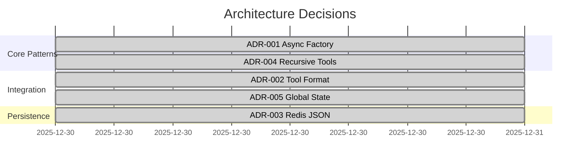
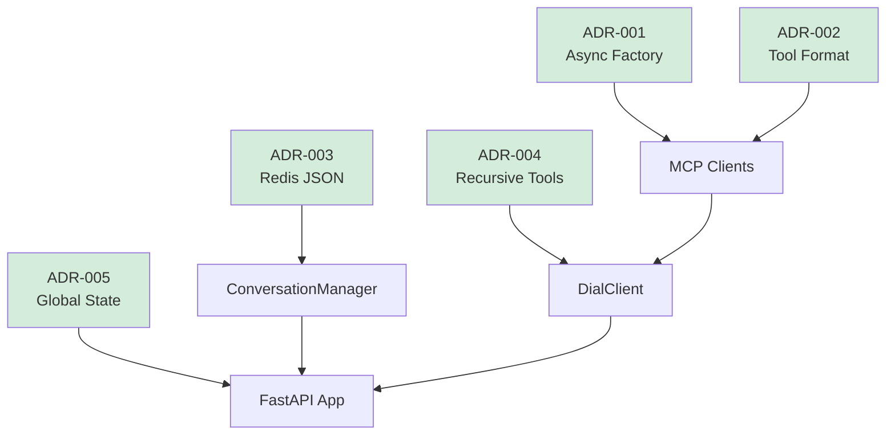

# Architecture Decision Records (ADR)

## Overview

This directory contains Architecture Decision Records (ADRs) documenting significant architectural choices made during the development of the Users Management Agent.

### What is an ADR?

An ADR is a document that captures an important architectural decision along with its context and consequences. Each ADR describes:
- **Context**: The situation requiring a decision
- **Decision**: The chosen approach
- **Alternatives**: Other options considered
- **Consequences**: Positive and negative outcomes
- **Status**: Proposed, Accepted, Rejected, Superseded

### ADR Format

Each ADR follows this template:

```markdown
# ADR-XXX: Decision Title

## Status
[Proposed | Accepted | Rejected | Superseded by ADR-YYY]

## Context
What is the issue we're facing? What constraints exist?

## Decision
What architectural decision are we making?

## Alternatives Considered
What other options did we evaluate?

## Consequences

### Positive
- Benefits of this decision

### Negative
- Drawbacks or trade-offs

### Neutral
- Other impacts

## Implementation Notes
Specific guidance for implementation (optional)

## Related Decisions
- ADR-YYY: Related decision
```

---

## Index of ADRs

### ADR-001: Async Factory Pattern for MCP Clients
**Status**: Accepted  
**Date**: 2025-12-30  
**Summary**: Use async factory methods (`create()`) instead of `__init__()` for MCP client initialization to handle async connection operations.  
**Impact**: Core pattern used by `HttpMCPClient` and `StdioMCPClient`.  
[Read full ADR →](./ADR-001-async-factory-pattern.md)

---

### ADR-002: Tool Format Conversion in MCP Clients
**Status**: Accepted  
**Date**: 2025-12-30  
**Summary**: Convert tool definitions from MCP (Anthropic) format to DIAL (OpenAI) format in `get_tools()` method of MCP clients.  
**Impact**: Enables uniform tool handling across different MCP servers.  
[Read full ADR →](./ADR-002-tool-format-conversion.md)

---

### ADR-003: Redis JSON Serialization
**Status**: Accepted  
**Date**: 2025-12-30  
**Summary**: Store conversations as JSON strings in Redis rather than using Redis Hash or JSON module.  
**Impact**: Persistence layer implementation in `ConversationManager`.  
[Read full ADR →](./ADR-003-redis-json-serialization.md)

---

### ADR-004: Recursive Tool Calling
**Status**: Accepted  
**Date**: 2025-12-30  
**Summary**: Implement recursive pattern in `DialClient` to handle multi-step tool calling scenarios.  
**Impact**: Core execution pattern for agent tool use.  
[Read full ADR →](./ADR-004-recursive-tool-calling.md)

---

### ADR-005: Global ConversationManager State
**Status**: Accepted  
**Date**: 2025-12-30  
**Summary**: Use global variable for `ConversationManager` initialized during FastAPI lifespan rather than dependency injection.  
**Impact**: Endpoint implementation and testability.  
[Read full ADR →](./ADR-005-global-state-pattern.md)

---

## Decision Statistics

| Status | Count |
|--------|-------|
| Accepted | 5 |
| Proposed | 0 |
| Rejected | 0 |
| Superseded | 0 |
| **Total** | **5** |

## Decision Timeline



## Decision Map



## Creating New ADRs

### When to Create an ADR

Create an ADR when:
- Making a significant architectural choice
- Choosing between multiple viable alternatives
- Establishing a pattern others will follow
- Making a decision with long-term consequences

**Do NOT** create ADRs for:
- Implementation details (belongs in code comments)
- Temporary workarounds
- Configuration changes
- Obvious choices with no alternatives

### Process

1. **Propose**: Create new ADR file with status "Proposed"
   ```bash
   cp ADR-template.md ADR-006-your-decision.md
   ```

2. **Discuss**: Share with team for feedback

3. **Decide**: Update status to "Accepted" or "Rejected"

4. **Update Index**: Add entry to this README.md

5. **Cross-Reference**: Link from relevant documentation

### Naming Convention

`ADR-XXX-short-description.md`

Examples:
- `ADR-001-async-factory-pattern.md`
- `ADR-006-auth-provider-selection.md`
- `ADR-010-conversation-summarization.md`

### Numbering

ADRs are numbered sequentially starting from 001. Numbers are never reused, even if an ADR is rejected.

## Superseding Decisions

When a decision is revisited:

1. **Do NOT** modify the original ADR
2. Create a new ADR with updated decision
3. Mark old ADR status: "Superseded by ADR-XXX"
4. Mark new ADR: "Supersedes ADR-YYY"
5. Update both index entries

Example:
```markdown
## Status
Superseded by ADR-010 (2026-01-15)
```

## Review Process

ADRs should be reviewed:
- **Quarterly**: Ensure decisions still valid
- **On Major Changes**: When system evolves significantly
- **Before Releases**: Confirm alignment with current state

## References

- [ADR GitHub Organization](https://adr.github.io/)
- [Documenting Architecture Decisions](https://cognitect.com/blog/2011/11/15/documenting-architecture-decisions)
- [Markdown Architectural Decision Records](https://adr.github.io/madr/)

---

**Next Steps**: Read individual ADRs to understand specific decisions, or consult [Architecture Guide](../architecture.md) for system overview.
