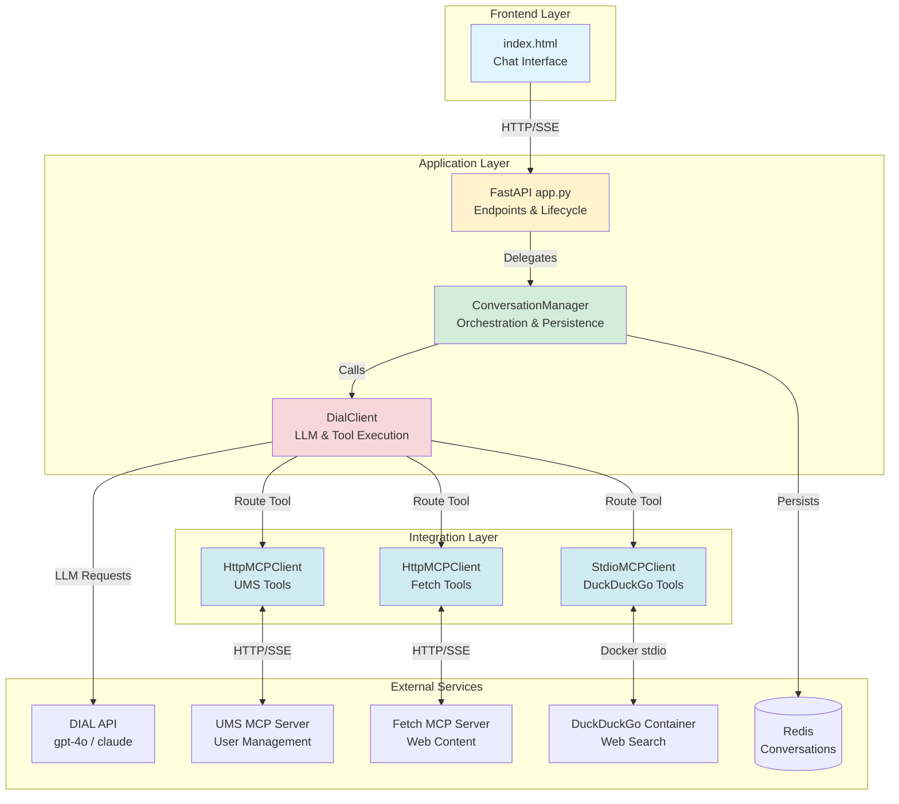
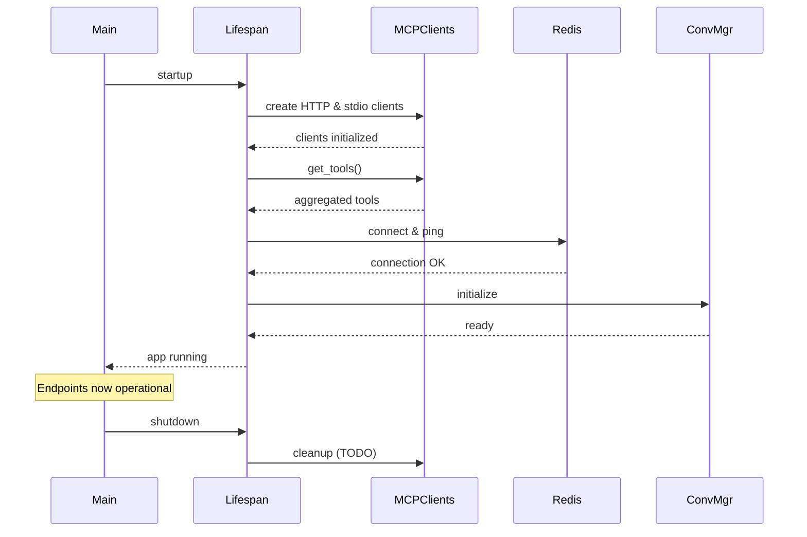
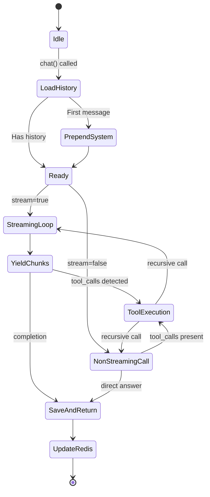
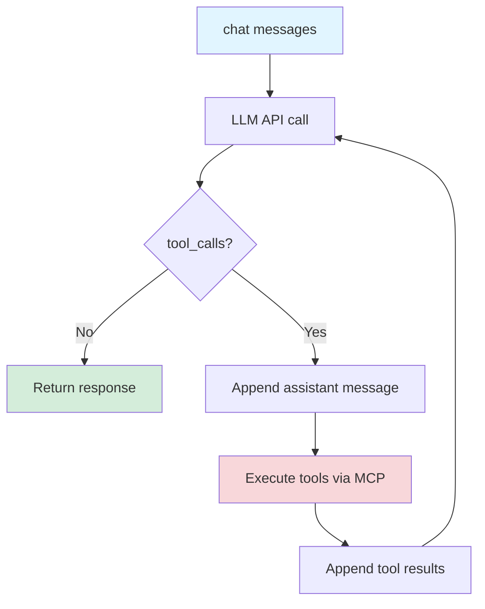
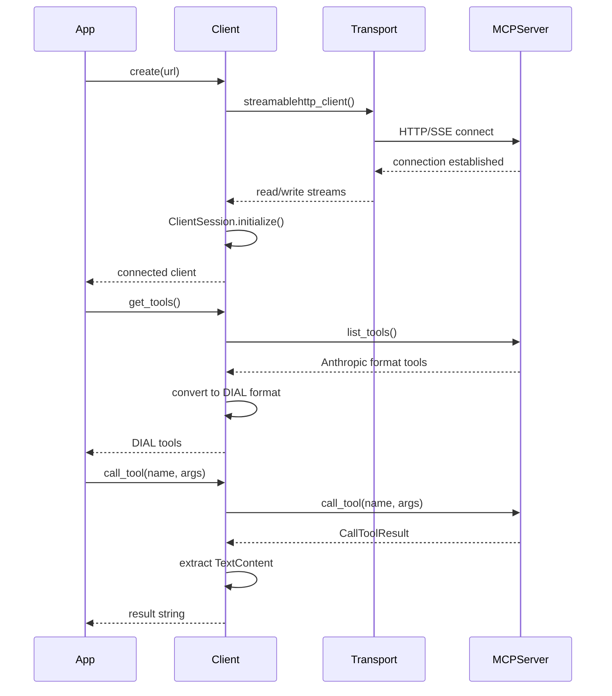
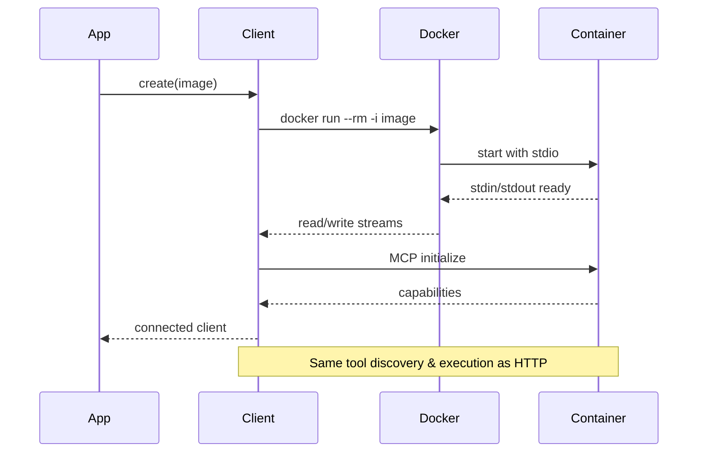
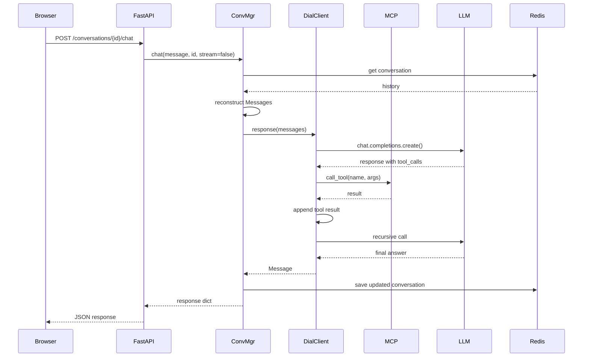
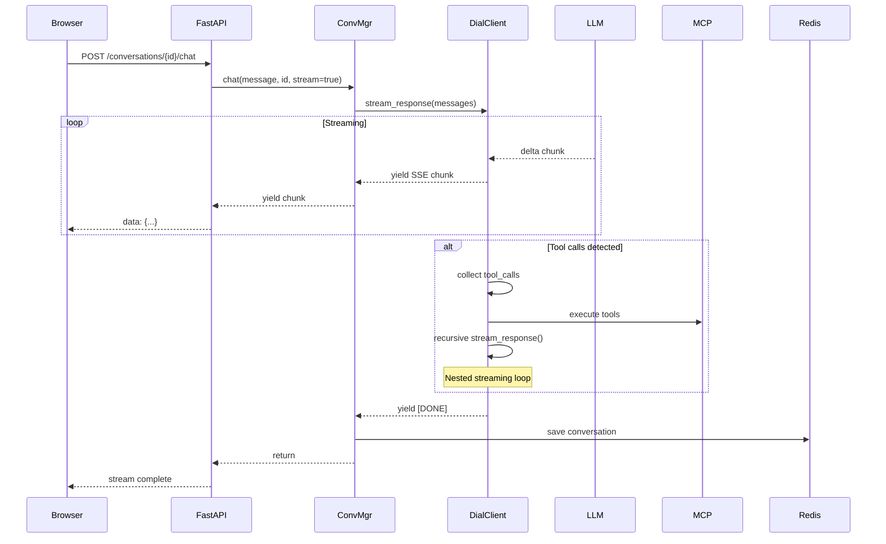

# System Architecture

## Table of Contents

- [Overview](#overview)
- [High-Level Architecture](#high-level-architecture)
- [Component Architecture](#component-architecture)
- [Data Flow](#data-flow)
- [Integration Points](#integration-points)
- [Design Decisions](#design-decisions)
- [Constraints & Limitations](#constraints--limitations)

## Overview

The Users Management Agent implements a **Tool Use Agent** pattern where an LLM orchestrates multiple tools via the Model Context Protocol (MCP). The system is designed as a learning workshop to demonstrate production-grade patterns for AI agent development.

### System Goals

1. **Educational**: Teach MCP integration, tool calling, and agent patterns
2. **Production-ready**: Demonstrate persistence, streaming, and error handling
3. **Extensible**: Support multiple MCP transports (HTTP, stdio) and easy tool addition
4. **Observable**: Enable debugging through logs, Redis inspection, and health checks

## High-Level Architecture



### Architectural Layers

| Layer | Components | Responsibility |
|-------|-----------|----------------|
| **Frontend** | [index.html](../index.html) | User interaction, SSE streaming, conversation UI |
| **Application** | [app.py](../agent/app.py), [conversation_manager.py](../agent/conversation_manager.py) | API endpoints, chat orchestration, persistence |
| **Integration** | [dial_client.py](../agent/clients/dial_client.py), MCP clients | LLM communication, tool routing, MCP protocol |
| **External** | DIAL API, MCP servers, Redis | LLM inference, tool execution, data storage |

## Component Architecture

### FastAPI Application (app.py)

**Responsibility**: Application lifecycle, endpoint routing, MCP client initialization



**Key Patterns**:
- **Async Context Manager**: `@asynccontextmanager` for startup/shutdown lifecycle
- **Global State**: `conversation_manager` shared across all endpoints
- **Aggregated Tools**: Combines tools from 3 MCP servers into unified list
- **Tool Routing**: Maps tool names to their respective MCP clients

**Code Location**: [agent/app.py](../agent/app.py)

### Conversation Manager

**Responsibility**: Chat orchestration, Redis persistence, streaming coordination



**Key Methods**:

| Method | Purpose | Side Effects |
|--------|---------|--------------|
| `create_conversation()` | Generate new UUID, save to Redis | Redis write, zadd to list |
| `list_conversations()` | Fetch summaries sorted by date | Redis read (zrevrange) |
| `get_conversation()` | Load full history | Redis read |
| `delete_conversation()` | Remove from Redis | Redis delete, zrem |
| `chat()` | Entry point for user message | Recursive LLM + tool calls |
| `_stream_chat()` | SSE streaming handler | Yields chunks, saves after |
| `_non_stream_chat()` | Blocking completion handler | Returns dict |

**Code Location**: [agent/conversation_manager.py](../agent/conversation_manager.py)

### DIAL Client

**Responsibility**: LLM communication, recursive tool calling, streaming/non-streaming modes



**Tool Calling Loop**:
1. Send messages to LLM (with tools parameter)
2. LLM returns response with optional `tool_calls` array
3. If tool calls present:
   - Append assistant message with tool_calls
   - Execute each tool via mapped MCP client
   - Append tool result messages (role=tool)
   - Recursively call LLM with updated messages
4. If no tool calls, return final answer

**Streaming vs Non-Streaming**:

| Aspect | Non-Streaming | Streaming |
|--------|---------------|-----------|
| **Method** | `response()` | `stream_response()` |
| **Return** | `Message` object | `AsyncGenerator[str, None]` |
| **Tool Calls** | Collected from response | Assembled from deltas |
| **Recursion** | Direct await | Nested async generators |
| **Format** | Python object | SSE `data:` chunks |

**Code Location**: [agent/clients/dial_client.py](../agent/clients/dial_client.py)

### MCP Clients

**Responsibility**: Connect to MCP servers, execute tools, convert formats

#### HTTP MCP Client



**Code Location**: [agent/clients/http_mcp_client.py](../agent/clients/http_mcp_client.py)

#### Stdio MCP Client



**Code Location**: [agent/clients/stdio_mcp_client.py](../agent/clients/stdio_mcp_client.py)

**Key Difference**: Transport mechanism (HTTP/SSE vs Docker stdio), but both implement same MCP protocol.

## Data Flow

### Chat Request Flow (Non-Streaming)



### Chat Request Flow (Streaming)



### Message Format Evolution

```mermaid
graph LR
    UI[User Input] --> M1[Message Object<br/>role=user]
    M1 --> Redis1[(Redis JSON)]
    Redis1 --> M2[Reconstructed Message]
    M2 --> DIAL1[to_dict<br/>OpenAI format]
    DIAL1 --> LLM[LLM API]
    LLM --> DIAL2[Assistant Message<br/>+ tool_calls]
    DIAL2 --> MCP1[MCP Format<br/>Anthropic]
    MCP1 --> MCP2[Tool Result]
    MCP2 --> DIAL3[Tool Message<br/>role=tool]
    DIAL3 --> Redis2[(Redis JSON)]
    
    style UI fill:#e1f5ff
    style M1 fill:#d4edda
    style DIAL1 fill:#f8d7da
    style MCP1 fill:#d1ecf1
```



## Integration Points

### DIAL API Integration

**Endpoint**: `https://ai-proxy.lab.epam.com`

**Requirements**:
- EPAM VPN connection
- Valid API key in `DIAL_API_KEY` environment variable
- Empty `api_version=""` parameter (DIAL-specific)

**Supported Models**:
- `gpt-4o` (OpenAI)
- `claude-3-7-sonnet@20250219` (Anthropic)

**Authentication**:
```python
AsyncAzureOpenAI(
    api_key=os.getenv("DIAL_API_KEY"),
    azure_endpoint="https://ai-proxy.lab.epam.com",
    api_version=""  # Must be empty for DIAL
)
```

### MCP Server Integrations

| MCP Server | Transport | Purpose | Tools |
|------------|-----------|---------|-------|
| **UMS** | HTTP/SSE | User management CRUD | create_user, get_user, search_users, update_user, delete_user |
| **Fetch** | HTTP/SSE | Web content retrieval | fetch_url, extract_content |
| **DuckDuckGo** | Docker stdio | Web search | web_search |

**Connection Details**:
- **UMS**: `http://localhost:8005/mcp` (requires docker-compose)
- **Fetch**: `https://remote.mcpservers.org/fetch/mcp` (remote)
- **DuckDuckGo**: `mcp/duckduckgo:latest` (Docker image)

### Redis Integration

**Purpose**: Conversation persistence and indexing

**Schema**:

```
Key: conversation:{uuid}
Type: String (JSON)
Value: {
  "id": "uuid",
  "title": "string",
  "messages": [{role, content, ...}],
  "created_at": "ISO 8601",
  "updated_at": "ISO 8601"
}

Key: conversations:list
Type: Sorted Set
Score: Unix timestamp (updated_at)
Member: conversation_id
```

**Operations**:
- `GET conversation:{id}` - Load conversation
- `SET conversation:{id}` - Save conversation
- `ZADD conversations:list` - Index conversation
- `ZREVRANGE conversations:list 0 -1` - List all conversations (newest first)
- `DELETE conversation:{id}` - Delete conversation
- `ZREM conversations:list {id}` - Remove from index

## Design Decisions

### ADR-001: Async Factory Pattern for MCP Clients

**Context**: Python `__init__` cannot be async, but MCP connection requires async operations.

**Decision**: Use `@classmethod async def create()` factory method.

**Consequences**:
- ✅ Ensures clients are connected before use
- ✅ Prevents race conditions and incomplete initialization
- ❌ Requires discipline (developers must use `await create()`, not `__init__()`)

**References**: [ADR-001](./adr/ADR-001-async-factory-pattern.md)

### ADR-002: Tool Format Conversion in MCP Clients

**Context**: MCP uses Anthropic format, DIAL expects OpenAI format.

**Decision**: Convert in `get_tools()` method of MCP clients.

**Consequences**:
- ✅ DialClient receives uniform format
- ✅ Easy to add new MCP servers
- ❌ Slight overhead (negligible, happens once at startup)

**References**: [ADR-002](./adr/ADR-002-tool-format-conversion.md)

### ADR-003: Redis JSON Serialization

**Context**: Need to persist complex Message objects with nested data.

**Decision**: Serialize entire conversation dict to JSON string, store as Redis string value.

**Alternatives Considered**:
- Redis Hash: Would require flattening messages array
- Redis JSON module: Additional dependency

**Consequences**:
- ✅ Simple serialization with `json.dumps()`
- ✅ Works with standard Redis
- ❌ Full conversation fetch required (no partial updates)

**References**: [ADR-003](./adr/ADR-003-redis-json-serialization.md)

### ADR-004: Recursive Tool Calling

**Context**: LLM may need multiple tool calls to answer complex queries.

**Decision**: Implement recursive pattern in `DialClient.response()` and `stream_response()`.

**Consequences**:
- ✅ Handles multi-step reasoning
- ✅ Transparent to ConversationManager
- ⚠️ Risk of infinite loops (mitigated by LLM's convergence behavior)

**References**: [ADR-004](./adr/ADR-004-recursive-tool-calling.md)

### ADR-005: Global ConversationManager State

**Context**: Need to share initialized clients across FastAPI endpoints.

**Decision**: Use global variable set during `lifespan()` startup.

**Alternatives Considered**:
- Dependency injection
- Application state

**Consequences**:
- ✅ Simple access in endpoints
- ✅ Initialized once, reused everywhere
- ❌ Less testable (requires mocking global)
- ❌ Not thread-safe (but FastAPI uses async, not threads)

**References**: [ADR-005](./adr/ADR-005-global-state-pattern.md)

## Constraints & Limitations

### Technical Constraints

| Constraint | Impact | Mitigation |
|------------|--------|------------|
| **EPAM VPN Required** | DIAL API inaccessible outside VPN | Document requirement clearly |
| **Docker Dependency** | DuckDuckGo MCP requires Docker | Use HTTP-only MCP servers as alternative |
| **Redis Single-Point** | No HA/clustering | Acceptable for learning project; production would use Redis Cluster |
| **No Authentication** | Open API endpoints | Explicitly noted as skipped for workshop scope |
| **Message Size Limits** | Large conversations may exceed Redis limits | TODO: Implement conversation summarization |

### Performance Considerations

| Aspect | Consideration | Impact |
|--------|---------------|--------|
| **Streaming Latency** | SSE requires persistent connections | Browser connection limits (~6 per domain) |
| **Tool Call Overhead** | Each tool call is network round-trip | Sequential execution (no parallelization) |
| **Redis Fetch** | Full conversation loaded on each chat | O(n) with conversation length |
| **Docker Startup** | Stdio MCP client starts container on connect | ~2-3s startup delay |
| **Recursive Depth** | No hard limit on tool calling loops | Relies on LLM to converge |

### Security Limitations

⚠️ **This is a learning project. Production deployment requires**:

- Authentication & authorization
- API rate limiting
- Input validation & sanitization
- PII detection and redaction (see Additional Task)
- Secure credential management (not env vars)
- CORS restriction (currently `allow_origins=["*"]`)

### Known Issues

| Issue | Status | Workaround |
|-------|--------|------------|
| MCP client cleanup not implemented | TODO | Clients not closed on shutdown |
| No conversation size limits | TODO | Large histories may degrade performance |
| No retry logic for MCP/DIAL failures | TODO | Manual retry required |
| Frontend error handling minimal | TODO | Check browser console for errors |

## Future Enhancements

See [Roadmap](./roadmap.md) for detailed plans.

**High Priority**:
- PII detection and redaction
- Conversation summarization for long histories
- Parallel tool execution
- Proper MCP client cleanup

**Medium Priority**:
- Authentication integration
- Test coverage
- Observability (metrics, traces)
- Configuration management

**Low Priority**:
- Alternative MCP servers
- Multi-user support
- Conversation search

---

**Next Steps**: Review [API Reference](./api.md) for endpoint specifications, then consult [Setup Guide](./setup.md) for deployment instructions.
