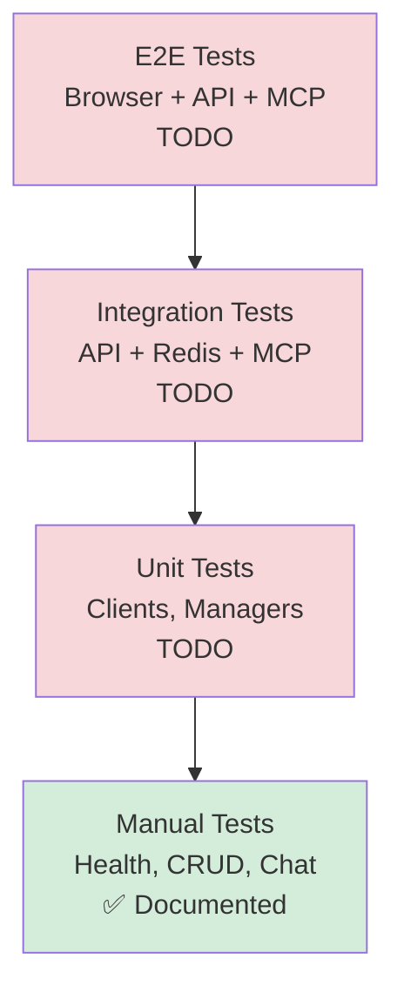

# Testing Guide

## Table of Contents

- [Overview](#overview)
- [Test Strategy](#test-strategy)
- [Manual Testing](#manual-testing)
- [Integration Testing](#integration-testing)
- [End-to-End Testing](#end-to-end-testing)
- [Debugging Guide](#debugging-guide)
- [Test Data](#test-data)

## Overview

### Current State

⚠️ **This is a learning/workshop project** - Automated test coverage is TODO.

**Implemented**:
- ✅ Manual testing procedures
- ✅ Health check endpoints
- ✅ Redis inspection via Redis Insight
- ✅ Logging for debugging

**TODO**:
- ❌ Unit tests (pytest)
- ❌ Integration tests
- ❌ E2E tests
- ❌ Test fixtures
- ❌ CI/CD pipeline

### Testing Philosophy

For this educational project, we focus on:
1. **Verification**: Ensure all components connect and communicate
2. **Tool Calling**: Validate LLM can invoke MCP tools correctly
3. **Persistence**: Confirm Redis stores/retrieves conversations
4. **Streaming**: Test SSE response delivery

## Test Strategy

### Test Pyramid



### Component Test Matrix

| Component | Unit Tests | Integration Tests | Manual Verification |
|-----------|-----------|-------------------|-------------------|
| [app.py](../agent/app.py) | TODO | TODO | ✅ Health check |
| [conversation_manager.py](../agent/conversation_manager.py) | TODO | TODO | ✅ CRUD operations |
| [dial_client.py](../agent/clients/dial_client.py) | TODO | TODO | ✅ Chat responses |
| [http_mcp_client.py](../agent/clients/http_mcp_client.py) | TODO | TODO | ✅ Tool discovery |
| [stdio_mcp_client.py](../agent/clients/stdio_mcp_client.py) | TODO | TODO | ✅ Docker connection |
| [index.html](../index.html) | N/A | TODO | ✅ Browser testing |

### Feature-to-Code-to-Test Traceability

| Feature | Code Module | Manual Test | Auto Test |
|---------|-------------|-------------|-----------|
| Create conversation | ConversationManager.create_conversation() | ✅ POST /conversations | TODO |
| List conversations | ConversationManager.list_conversations() | ✅ GET /conversations | TODO |
| Delete conversation | ConversationManager.delete_conversation() | ✅ DELETE /conversations/{id} | TODO |
| Non-streaming chat | DialClient.response() | ✅ POST /chat (stream=false) | TODO |
| Streaming chat | DialClient.stream_response() | ✅ POST /chat (stream=true) | TODO |
| Tool execution | DialClient._call_tools() | ✅ User management prompts | TODO |
| Redis persistence | ConversationManager._save_conversation() | ✅ Redis Insight inspection | TODO |
| MCP HTTP connection | HttpMCPClient.connect() | ✅ Health checks | TODO |
| MCP stdio connection | StdioMCPClient.connect() | ✅ Docker ps | TODO |

## Manual Testing

### Prerequisites

Ensure all services are running:
```bash
# 1. Start Docker services
docker-compose up -d

# 2. Start FastAPI
source dial_ums/bin/activate
export DIAL_API_KEY="your-key"
python -m agent.app

# 3. Verify all healthy
curl http://localhost:8011/health
curl http://localhost:8005/health
redis-cli ping
```

### Test Suite 1: Health & Connectivity

#### Test 1.1: Application Health

**Objective**: Verify FastAPI and ConversationManager initialization.

```bash
curl -s http://localhost:8011/health | jq
```

**Expected**:
```json
{
  "status": "healthy",
  "conversation_manager_initialized": true
}
```

**✅ Pass Criteria**: `status == "healthy"` AND `conversation_manager_initialized == true`

---

#### Test 1.2: UMS MCP Server Health

**Objective**: Verify UMS MCP server is accessible.

```bash
curl -s http://localhost:8005/health | jq
```

**Expected**:
```json
{
  "status": "healthy"
}
```

**✅ Pass Criteria**: `status == "healthy"`

---

#### Test 1.3: Redis Connectivity

**Objective**: Verify Redis is accepting connections.

```bash
redis-cli ping
```

**Expected**: `PONG`

**✅ Pass Criteria**: Response is `PONG`

---

#### Test 1.4: Docker Services Status

**Objective**: Verify all Docker containers are running.

```bash
docker-compose ps
```

**Expected**: All services show `Up` status.

**✅ Pass Criteria**: No containers in `Exit` state.

---

### Test Suite 2: Conversation CRUD

#### Test 2.1: Create Conversation

**Objective**: Create new conversation with UUID.

```bash
curl -X POST http://localhost:8011/conversations \
  -H "Content-Type: application/json" \
  -d '{"title": "Test Conversation"}' \
  -s | jq
```

**Expected**:
```json
{
  "id": "<valid-uuid>",
  "title": "Test Conversation",
  "messages": [],
  "created_at": "<ISO-8601-timestamp>",
  "updated_at": "<ISO-8601-timestamp>"
}
```

**✅ Pass Criteria**:
- `id` is valid UUID format
- `title` matches input
- `messages` is empty array
- Timestamps are valid ISO 8601

**Save ID for next tests**:
```bash
CONV_ID=$(curl -X POST http://localhost:8011/conversations \
  -H "Content-Type: application/json" \
  -d '{"title": "Test"}' -s | jq -r '.id')
echo "Conversation ID: $CONV_ID"
```

---

#### Test 2.2: List Conversations

**Objective**: Retrieve all conversations sorted by updated_at.

```bash
curl -s http://localhost:8011/conversations | jq
```

**Expected**:
```json
[
  {
    "id": "<uuid>",
    "title": "Test Conversation",
    "created_at": "<timestamp>",
    "updated_at": "<timestamp>",
    "message_count": 0
  }
]
```

**✅ Pass Criteria**:
- Array contains created conversation
- `message_count` is 0 for new conversation
- Sorted by `updated_at` descending

---

#### Test 2.3: Get Conversation

**Objective**: Retrieve full conversation with messages.

```bash
curl -s http://localhost:8011/conversations/$CONV_ID | jq
```

**Expected**:
```json
{
  "id": "<uuid>",
  "title": "Test",
  "messages": [],
  "created_at": "<timestamp>",
  "updated_at": "<timestamp>"
}
```

**✅ Pass Criteria**:
- `id` matches `$CONV_ID`
- `messages` array is present (empty for new conversation)

---

#### Test 2.4: Delete Conversation

**Objective**: Remove conversation from Redis.

```bash
curl -X DELETE http://localhost:8011/conversations/$CONV_ID -s | jq
```

**Expected**:
```json
{
  "success": true
}
```

**Verify deletion**:
```bash
curl -s http://localhost:8011/conversations/$CONV_ID
```

**Expected**: `{"detail": "Conversation not found"}`

**✅ Pass Criteria**:
- Delete returns `success: true`
- Subsequent GET returns 404

---

### Test Suite 3: Chat Interactions

#### Test 3.1: Non-Streaming Chat (Simple)

**Objective**: Send message and receive complete response.

```bash
# Create conversation
CONV_ID=$(curl -X POST http://localhost:8011/conversations \
  -H "Content-Type: application/json" \
  -d '{"title": "Chat Test"}' -s | jq -r '.id')

# Send message
curl -X POST http://localhost:8011/conversations/$CONV_ID/chat \
  -H "Content-Type: application/json" \
  -d '{
    "message": {"role": "user", "content": "Hello, who are you?"},
    "stream": false
  }' -s | jq
```

**Expected**:
```json
{
  "content": "I am a User Management Assistant...",
  "conversation_id": "<uuid>"
}
```

**✅ Pass Criteria**:
- Response contains `content` with assistant message
- `conversation_id` matches `$CONV_ID`
- Response references system prompt capabilities

---

#### Test 3.2: Non-Streaming Chat (Tool Calling)

**Objective**: Verify LLM invokes UMS tools correctly.

```bash
curl -X POST http://localhost:8011/conversations/$CONV_ID/chat \
  -H "Content-Type: application/json" \
  -d '{
    "message": {"role": "user", "content": "Show me all users"},
    "stream": false
  }' -s | jq
```

**Expected**:
```json
{
  "content": "Here are all users:\n\n1. John Doe (ID: 1)...",
  "conversation_id": "<uuid>"
}
```

**✅ Pass Criteria**:
- Response includes user data (from search_users tool)
- Check application logs for tool call:
  ```
  INFO: Calling tool 'search_users' on http://localhost:8005/mcp
  ```

**Verify in Redis**:
```bash
redis-cli GET conversation:$CONV_ID | jq '.messages[-3:]'
```

**Expected message sequence**:
1. User message: `"Show me all users"`
2. Assistant message with `tool_calls`
3. Tool message with `role: "tool"` and result
4. Assistant message with final answer

---

#### Test 3.3: Streaming Chat

**Objective**: Receive SSE-formatted response stream.

```bash
curl -N -X POST http://localhost:8011/conversations/$CONV_ID/chat \
  -H "Content-Type: application/json" \
  -d '{
    "message": {"role": "user", "content": "What is MCP?"},
    "stream": true
  }'
```

**Expected output** (example):
```
data: {"conversation_id": "550e8400-e29b-41d4-a716-446655440000"}

data: {"choices": [{"delta": {"content": "MCP"}, "index": 0, "finish_reason": null}]}

data: {"choices": [{"delta": {"content": " stands"}, "index": 0, "finish_reason": null}]}

...

data: {"choices": [{"delta": {}, "index": 0, "finish_reason": "stop"}]}

data: [DONE]
```

**✅ Pass Criteria**:
- First event contains `conversation_id`
- Multiple delta events with `content` chunks
- Final event has `finish_reason: "stop"`
- Stream ends with `data: [DONE]`

---

#### Test 3.4: Streaming Chat with Tool Calling

**Objective**: Verify streaming continues after tool execution.

```bash
curl -N -X POST http://localhost:8011/conversations/$CONV_ID/chat \
  -H "Content-Type: application/json" \
  -d '{
    "message": {"role": "user", "content": "Find user with ID 42"},
    "stream": true
  }'
```

**Expected**:
- Stream starts immediately
- Pause during tool execution (no chunks)
- Stream resumes with tool results
- Ends with `[DONE]`

**✅ Pass Criteria**:
- Stream completes successfully
- Response includes user data
- Application logs show tool call

---

### Test Suite 4: MCP Integration

#### Test 4.1: UMS MCP Tools Discovery

**Objective**: Verify HttpMCPClient retrieves UMS tools.

```python
# Run in Python shell
python
>>> from agent.clients.http_mcp_client import HttpMCPClient
>>> import asyncio
>>> client = asyncio.run(HttpMCPClient.create("http://localhost:8005/mcp"))
>>> tools = asyncio.run(client.get_tools())
>>> print([t['function']['name'] for t in tools])
```

**Expected**:
```python
['create_user', 'get_user', 'search_users', 'update_user', 'delete_user']
```

**✅ Pass Criteria**: All UMS tools are discovered.

---

#### Test 4.2: DuckDuckGo MCP Tools Discovery

**Objective**: Verify StdioMCPClient connects to Docker container.

```python
>>> from agent.clients.stdio_mcp_client import StdioMCPClient
>>> client = asyncio.run(StdioMCPClient.create("mcp/duckduckgo:latest"))
>>> tools = asyncio.run(client.get_tools())
>>> print([t['function']['name'] for t in tools])
```

**Expected**:
```python
['web_search']
```

**Verify Docker container**:
```bash
docker ps | grep duckduckgo
# Should NOT show running container (--rm flag removes it after use)
```

**✅ Pass Criteria**: web_search tool is discovered.

---

#### Test 4.3: Tool Execution

**Objective**: Directly execute MCP tool.

```python
>>> result = asyncio.run(client.call_tool("search_users", {}))
>>> print(result)
```

**Expected**: JSON array of users or error message.

**✅ Pass Criteria**: Tool returns data without exceptions.

---

### Test Suite 5: Redis Persistence

#### Test 5.1: Conversation Storage

**Objective**: Verify conversations are persisted in Redis.

```bash
# Create conversation
CONV_ID=$(curl -X POST http://localhost:8011/conversations \
  -H "Content-Type: application/json" \
  -d '{"title": "Redis Test"}' -s | jq -r '.id')

# Check Redis
redis-cli GET conversation:$CONV_ID
```

**Expected**: JSON string with conversation data.

**✅ Pass Criteria**: Key exists with valid JSON.

---

#### Test 5.2: Conversation List Index

**Objective**: Verify sorted set maintains conversation order.

```bash
redis-cli ZREVRANGE conversations:list 0 -1 WITHSCORES
```

**Expected**:
```
1) "550e8400-e29b-41d4-a716-446655440000"
2) "1735552200.123"
3) "6ba7b810-9dad-11d1-80b4-00c04fd430c8"
4) "1735465800.456"
```

**✅ Pass Criteria**:
- Conversations ordered by timestamp (descending)
- Scores are Unix timestamps

---

#### Test 5.3: Message Persistence After Chat

**Objective**: Verify messages are saved after chat completion.

```bash
# Send message
curl -X POST http://localhost:8011/conversations/$CONV_ID/chat \
  -H "Content-Type: application/json" \
  -d '{
    "message": {"role": "user", "content": "Test message"},
    "stream": false
  }' -s > /dev/null

# Check Redis
redis-cli GET conversation:$CONV_ID | jq '.messages | length'
```

**Expected**: Number > 0 (at least system + user + assistant messages).

**✅ Pass Criteria**: Messages array contains chat history.

---

### Test Suite 6: Frontend (Browser)

#### Test 6.1: UI Load

**Objective**: Verify HTML loads without errors.

1. Open [index.html](../index.html) in browser (Chrome/Firefox)
2. Open Developer Tools (F12) → Console tab
3. Check for JavaScript errors

**✅ Pass Criteria**: No console errors on load.

---

#### Test 6.2: Create Conversation (UI)

**Objective**: Test UI conversation creation.

1. Click "New Chat" button
2. Verify new conversation appears in sidebar
3. Check Network tab for successful POST request

**✅ Pass Criteria**:
- Conversation appears in sidebar
- POST /conversations returns 200
- Conversation is selected (highlighted)

---

#### Test 6.3: Send Message (UI)

**Objective**: Test chat interaction via UI.

1. Type "Hello" in message input
2. Click Send or press Enter
3. Observe streaming response

**✅ Pass Criteria**:
- Message appears in chat
- Loading indicator shows during request
- Assistant response streams character-by-character
- Message persists after page reload

---

#### Test 6.4: Delete Conversation (UI)

**Objective**: Test conversation deletion.

1. Hover over conversation in sidebar
2. Click "Delete" button
3. Confirm deletion

**✅ Pass Criteria**:
- Conversation removed from sidebar
- DELETE request returns 200
- Conversation no longer in Redis

---

## Integration Testing

### TODO: Automated Integration Tests

**Planned test structure**:

```python
# tests/integration/test_conversation_flow.py
import pytest
from agent.conversation_manager import ConversationManager
from agent.clients.dial_client import DialClient

@pytest.mark.asyncio
async def test_create_and_chat(conversation_manager, dial_client):
    """Test full conversation flow with Redis persistence."""
    # Create conversation
    conv = await conversation_manager.create_conversation("Test")
    assert conv['id']
    
    # Send message
    result = await conversation_manager.chat(
        Message(role=Role.USER, content="Hello"),
        conv['id'],
        stream=False
    )
    assert result['content']
    
    # Verify persistence
    retrieved = await conversation_manager.get_conversation(conv['id'])
    assert len(retrieved['messages']) > 0
```

**Fixtures needed**:
- `conversation_manager`: Connected to test Redis instance
- `dial_client`: Mock or real DIAL API client
- `mcp_clients`: Mock or real MCP clients

---

## End-to-End Testing

### TODO: Browser Automation

**Planned tools**:
- Playwright or Selenium for browser automation
- Test SSE streaming reception
- Validate UI state updates

**Example test**:
```python
# tests/e2e/test_ui_chat.py
def test_chat_flow(page):
    """Test complete user journey."""
    page.goto("file:///path/to/index.html")
    
    # Create conversation
    page.click("button:has-text('New Chat')")
    
    # Send message
    page.fill("input[placeholder='Type your message...']", "Hello")
    page.click("button:has-text('Send')")
    
    # Wait for response
    page.wait_for_selector(".message.assistant")
    
    # Verify message displayed
    messages = page.locator(".message")
    assert messages.count() >= 2  # User + Assistant
```

---

## Debugging Guide

### Enabling Debug Logging

**Application logs**:
```bash
export LOG_LEVEL=DEBUG
python -m agent.app
```

**Component-specific logging**:
```python
# Add to agent/app.py
import logging
logging.getLogger("agent.clients.dial_client").setLevel(logging.DEBUG)
logging.getLogger("agent.conversation_manager").setLevel(logging.DEBUG)
```

### Inspecting Message Flow

**Add logging to DialClient**:
```python
# In dial_client.py response()
logger.debug(f"Sending to LLM: {[m.to_dict() for m in messages]}")
logger.debug(f"LLM response: {response}")
logger.debug(f"Tool calls: {ai_message.tool_calls}")
```

### Redis Debugging

**Monitor real-time commands**:
```bash
redis-cli MONITOR
```

**Inspect conversation structure**:
```bash
redis-cli GET conversation:<uuid> | jq '.'
```

### Network Debugging

**Capture HTTP traffic**:
```bash
# Using mitmproxy
pip install mitmproxy
mitmproxy -p 8080

# Configure Python to use proxy
export HTTP_PROXY=http://localhost:8080
export HTTPS_PROXY=http://localhost:8080
python -m agent.app
```

### Docker Logs

**MCP server logs**:
```bash
docker-compose logs -f ums-mcp-server
```

**DuckDuckGo container** (ephemeral):
```bash
# Run manually to see output
docker run --rm -i mcp/duckduckgo:latest
```

---

## Test Data

### Sample Conversations

**Simple greeting**:
```json
{
  "message": {"role": "user", "content": "Hello"},
  "stream": false
}
```

**User management queries**:
```json
{"message": {"role": "user", "content": "Show me all users"}, "stream": false}
{"message": {"role": "user", "content": "Find user with email john@example.com"}, "stream": false}
{"message": {"role": "user", "content": "Create a new user named Alice"}, "stream": false}
{"message": {"role": "user", "content": "Update user 42's email to new@example.com"}, "stream": false}
{"message": {"role": "user", "content": "Delete user with ID 99"}, "stream": false}
```

**Web search queries**:
```json
{"message": {"role": "user", "content": "Search the web for MCP protocol"}, "stream": false}
{"message": {"role": "user", "content": "What is the latest news about AI?"}, "stream": false}
```

**Multi-tool queries**:
```json
{"message": {"role": "user", "content": "Find user John Doe and search web for his company"}, "stream": false}
```

### Edge Cases

**Empty content**:
```json
{"message": {"role": "user", "content": ""}, "stream": false}
```

**Very long message** (test token limits):
```json
{"message": {"role": "user", "content": "<repeat 'word ' 10000 times>"}, "stream": false}
```

**Special characters**:
```json
{"message": {"role": "user", "content": "Search for user with name <script>alert('xss')</script>"}, "stream": false}
```

---

## Coverage Goals (TODO)

When implementing automated tests:

| Category | Target Coverage | Priority |
|----------|----------------|----------|
| Unit Tests | 80%+ | High |
| Integration Tests | Key flows (CRUD, chat, tools) | High |
| E2E Tests | Happy paths | Medium |
| Error Handling | Major error cases | Medium |
| Edge Cases | Input validation | Low |

---

**Next Steps**: Review [Roadmap](./roadmap.md) for planned test automation features or consult [Glossary](./glossary.md) for domain terminology.
